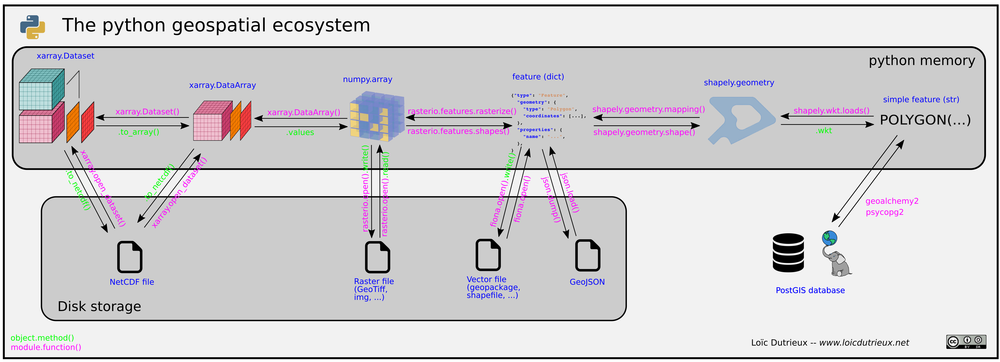

*I've had this mental image for a long time, I can finally share it*, made with [inkscape](https://inkscape.org/en/).

## Some additional links

### I/O, transformation, analysis

- [rasterio](https://rasterio.readthedocs.io/en/latest/): Read, write and transform raster data
- [fiona](http://toblerity.org/fiona/): Read and write vector data
- [xarray](http://xarray.pydata.org/en/stable/): *N-D labeled arrays and datasets in Python*
- [shapely](http://toblerity.org/shapely/): *Manipulation and analysis of geometric objects in the Cartesian plane*
- [pyproj](https://jswhit.github.io/pyproj/): *Performs cartographic transformations and geodetic computations*
- [geopandas](http://geopandas.org/): Spatial extension of pandas

### Visualization

- [descartes](https://pypi.python.org/pypi/descartes/): Plotting of spatial objects with matplotlib
- [fiolum](http://python-visualization.github.io/folium/): Interactive visualization of spatial objects with leaflet

### Databases

- [geoalchemy2](https://geoalchemy-2.readthedocs.io/en/latest/): The spatial ORM
- [Django gis extension](https://docs.djangoproject.com/en/2.0/ref/contrib/gis/): Not represented in the overview image above, but another handy option to interact with spatial databases.

### Other

- A nice [blog entry](http://www.perrygeo.com/python-affine-transforms.html) by Matthew Perry to understand the concept of affine transform
- Another [blog entry](https://medium.com/@christoph.k.rieke/essential-geospatial-python-libraries-5d82fcc38731) presenting a detailed overview of the python geospatial stack
